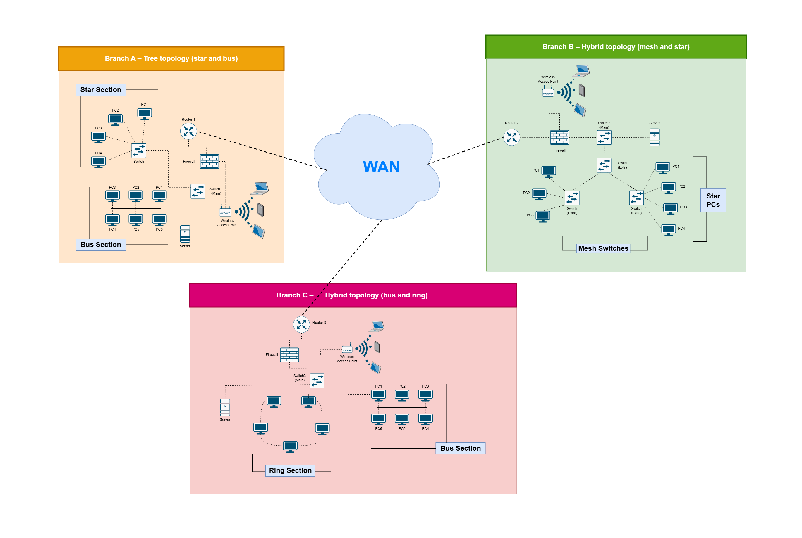
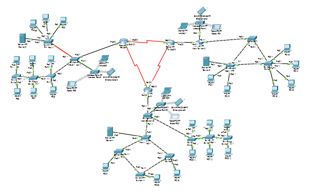
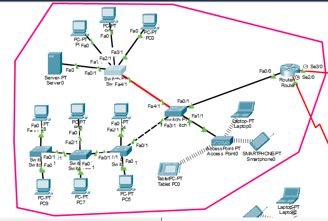
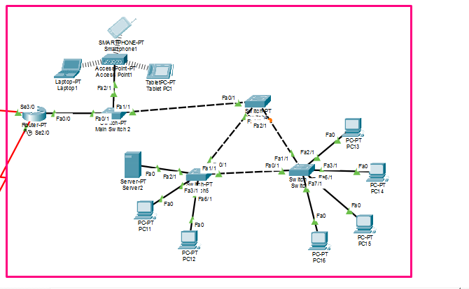
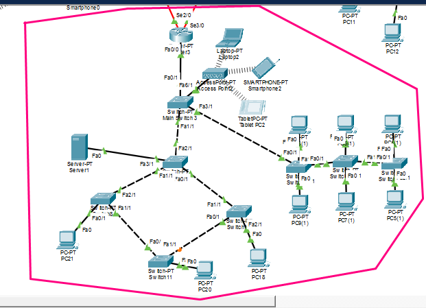

# 🌐 3-Branch Enterprise Network — Multi-Topology | Cisco Packet Tracer

A fully functional multi-branch enterprise network designed and implemented in **Cisco Packet Tracer**, featuring three branches each with a distinct network topology, interconnected over WAN serial links. The project covers IP addressing, VLAN segmentation, dynamic routing, wireless access, and comprehensive security hardening.

> **Note:** This repository contains the **logical implementation** of the physical network architecture originally designed in Assignment 1. During implementation in Cisco Packet Tracer, certain aspects of the design were adjusted for practical reasons — such as topology layout changes and device placement — while keeping the core network requirements intact.

---

## 📌 Project Overview

This project simulates a real-world enterprise network environment across **3 geographically separated branches**. Each branch uses a different physical topology and is fully configured with VLANs, inter-VLAN routing, RIPv2 dynamic routing, wireless access points, and both router and switch-level security.

---

## 🗺️ Original Physical Design (Assignment 1)

The network was first designed as a physical architecture before being implemented in Cisco Packet Tracer.



---

## 🖥️ Logical Implementation (Cisco Packet Tracer)

### Full Network — All 3 Branches Connected via WAN



---

### Branch A — Tree Topology (Star + Bus)



**Star section** — Main switch connects PCs in a star layout with a dedicated server.  
**Bus section** — Additional PCs connected through sub-switches forming a bus structure.  
Wireless Access Point provides Wi-Fi connectivity (VLAN 30).

---

### Branch B — Hybrid Topology (Mesh + Star)



**Mesh section** — Core switches are fully interconnected for redundancy.  
**Star section** — Additional PCs connected through a star-based sub-switch.  
Wireless Access Point provides Wi-Fi connectivity (VLAN 30).

---

### Branch C — Hybrid Topology (Bus + Ring)



**Ring section** — Switches connected in a ring for fault tolerance.  
**Bus section** — PCs connected in a linear bus arrangement.  
Wireless Access Point provides Wi-Fi connectivity (VLAN 30).

---

## 🏢 Network Architecture

```
        Branch A (Star + Bus)
              |
         [Router 1]
        /           \
  Serial            Serial
  10.1.2.0/30     10.1.1.0/30
      |                 |
 [Router 2]         [Router 3]
Branch B              Branch C
(Mesh + Star)       (Bus + Ring)
      \                /
       Serial 10.1.3.0/30
```

---

## 🔀 Branch Details

| Branch | Topology | Router | VLAN 10 (PCs) | VLAN 20 (Server) | VLAN 30 (Wi-Fi) |
|--------|----------|--------|---------------|------------------|-----------------|
| Branch A | Star + Bus | Router1 | 192.168.10.0/26 | 192.168.10.64/27 | 192.168.10.96/27 |
| Branch B | Mesh + Star | Router2 | 192.168.20.0/26 | 192.168.20.64/27 | 192.168.20.96/27 |
| Branch C | Bus + Ring | Router3 | 192.168.30.0/26 | 192.168.30.64/27 | 192.168.30.96/27 |

### WAN Links

| Link | Network | Router A End | Router B End |
|------|---------|-------------|-------------|
| Branch A ↔ Branch B | 10.1.2.0/30 | 10.1.2.1 | 10.1.2.2 |
| Branch A ↔ Branch C | 10.1.1.0/30 | 10.1.1.1 | 10.1.1.2 |
| Branch B ↔ Branch C | 10.1.3.0/30 | 10.1.3.1 | 10.1.3.2 |

---

## ⚙️ Features Implemented

### 🔷 IP Addressing & Subnetting
- Unique subnet per VLAN per branch using VLSM
- /26 for PC VLANs (up to 62 hosts), /27 for Server & Wi-Fi VLANs (up to 30 hosts)
- /30 for WAN point-to-point serial links

### 🔷 VLAN Configuration
- **VLAN 10** — PCs (user workstations)
- **VLAN 20** — Server
- **VLAN 30** — Wireless devices
- Trunk ports configured between switches and router
- Access ports assigned per device type

### 🔷 Inter-VLAN Routing
- Router-on-a-Stick using **dot1Q encapsulation** on subinterfaces
- Each VLAN mapped to a subinterface (fa0/0.10, fa0/0.20, fa0/0.30)
- Gateway IPs assigned as first usable address of each subnet

### 🔷 Dynamic Routing — RIP Version 2
- RIPv2 configured on all 3 routers
- `no auto-summary` enabled for classless routing
- Full inter-branch reachability via serial WAN links

### 🔷 Wireless Access
- Access Point configured on each branch
- SSID set per branch
- Wireless clients (laptop, smartphone, tablet) connected

### 🔷 Router Security
- `enable secret` — encrypted privileged mode password
- `line con 0` — console access password
- `line vty 0 4` — Telnet/SSH access password
- `banner motd` — unauthorized access warning message
- `service password-encryption` — all passwords encrypted in config

### 🔷 Switch Security
- Port security on access ports — max 1 MAC address
- Violation mode: `restrict`
- Sticky MAC address learning enabled
- Unused ports administratively shut down

---

## 🧪 Testing & Verification

| Test | Result |
|------|--------|
| Branch A Router → Branch B Router (ping) | ✅ Success |
| Branch A Router → Branch C Router (ping) | ✅ Success |
| Branch B Router → Branch C Router (ping) | ✅ Success |
| Branch A — PC (VLAN 10) → Server (VLAN 20) | ✅ Success |
| Branch A — PC (VLAN 10) → Wireless device (VLAN 30) | ✅ Success |
| Branch B — PC (VLAN 10) → Server (VLAN 20) | ✅ Success |
| Branch B — PC (VLAN 10) → Wireless device (VLAN 30) | ✅ Success |
| Branch C — PC (VLAN 10) → Server (VLAN 20) | ✅ Success |
| Branch C — PC (VLAN 10) → Wireless device (VLAN 30) | ✅ Success |
| RIP routing table propagation (all routers) | ✅ Success |
| VLAN table verification (all main switches) | ✅ Success |

---

## ⚠️ Challenges Faced

**Port Security on Trunk Ports**  
During initial switch configuration, port security was accidentally applied to trunk ports. This caused inter-VLAN ping failures since trunk ports carry traffic for multiple VLANs and should not have port-security restrictions. The issue was resolved by removing port-security from trunk ports and applying it exclusively to access ports.

---

## 🛠️ Tools Used

- [Cisco Packet Tracer 8.x](https://www.netacad.com/courses/packet-tracer)


## 📚 Concepts Covered

`Subnetting` `VLSM` `VLAN` `Trunking` `Inter-VLAN Routing` `Router-on-a-Stick` `dot1Q` `RIPv2` `WAN Serial Links` `Port Security` `Wireless Networking` `Network Security` `Star Topology` `Mesh Topology` `Ring Topology` `Hybrid Topology`
